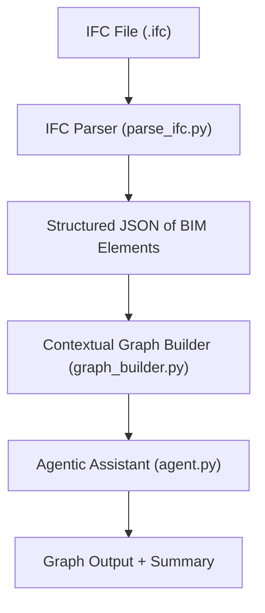

# 🚧 MOD Code Jam Challenge: BIM Context Graph + Agentic Assistant

Welcome to the MOD AI Code Jam! This is a collaborative and creative challenge where we'll prototype a core subsystem for MOD’s future Contextual GNN — with an agentic twist.

---

## 🧠 Goal

Build a modular pipeline that:

1. **Parses a BIM model from IFC format**
2. **Extracts contextual relationships (e.g., adjacency, containment, connectivity)**
3. **Constructs a graph abstraction (nodes + edges + attributes)**
4. **Wraps this into a lightweight agent** that responds to user prompts like:
   > “Build a graph with only load-bearing walls and adjacent doors.”

---

## 🎯 Why This Matters

MOD’s roadmap includes a **Contextual GNN Model (Q4 2025)** that interprets spatial logic in BIM models to support prefab validation and optimization. This challenge kicks off that direction.

You’ll also simulate how this capability would be embedded in a **LangGraph-style agent**, part of MOD’s broader AI-native architecture.

---

## 👥 Team Roles

- **Lukas**:  
  Lead BIM logic, define geometry extraction from IFC using tools like `ifcopenshell`.

- **Ata & Emilio**:  
  Lead graph extraction logic, feature engineering, and agent construction.

- **Yashar**:  
  Facilitate system modularity, ensure extensibility, and connect the work to MOD's GNN and mod-val/mod-rec future.

---

## 🔧 Tasks Overview

### 1. Parse IFC Model

- Use `ifcopenshell` (Python) to extract relevant spatial elements from a provided `.ifc` file
- Transform those elements into structured JSON (e.g., rooms, walls, doors with metadata)

### 2. Build Context Graph

- Nodes: prefab-suitable elements (e.g., rooms, walls, doors)
- Edges: spatial/semantic relationships
  - `adjacent_to`
  - `contained_in`
  - `connected_to`
- Attributes: type, dimensions, load-bearing status, etc.
- Output: Graph object (e.g., NetworkX) + JSON

### 3. Add Agentic Wrapper

Build a lightweight agent that:

- Accepts natural-language prompts
- Parses intent (e.g., which types of nodes/edges to include)
- Filters input and calls the graph builder
- Returns:
  - Graph (JSON or visualization)
  - Short explanation (e.g., “Graph has 6 nodes, 3 adjacency edges.”)

*Bonus*: Use GPT for prompt parsing or post-hoc explanation.

---

## ⏱️ Suggested Time Breakdown

| Phase     | Duration | Focus                                  |
|-----------|----------|----------------------------------------|
| Intro     | 30 min   | Walkthrough of challenge + Q&A         |
| Coding    | 2 hrs    | Build IFC parser + graph + agent       |
| Debrief   | 30 min   | Share solutions and discuss takeaways  |

---

## 📦 Inputs

We'll provide:

- A sample `.ifc` file representing a simple BIM scenario
- This repository includes optional starter utilities, type definitions, and graph I/O functions to help you get started quickly.
- Option to use OpenRouter or local GPT (via Ollama) if desired

---

## 📤 Output

- Python script or notebook that:
  - Parses IFC → structured JSON
  - Builds a context graph
  - Supports filtered prompt input via agent
- Graph output in JSON or `networkx` format
- (Optional) Visualization or GPT-based explanation
- Brief README or summary of approach

---

## 🔄 Processing Pipeline



---

## 🧑‍🔧 Tech Stack Suggestions

- Language: Python
- Libraries: `ifcopenshell`, `networkx`, `json`, `pydantic`, `trimesh`, `LangChain` (optional)
- GPT Access: OpenRouter or local Ollama (if used)
- Agent Emulation: Minimal planning → tool call → return

---

## 🗂️ Project Structure

```tree
ai-code-jam-gnn/
├── data/
│   └── sample.ifc              # Sample BIM model in IFC format
├── src/
│   ├── parse_ifc.py               # IFC → JSON extraction script
│   ├── graph_builder.py           # Core graph construction logic
│   ├── agent.py                   # Agent interface for prompt interpretation
│   ├── main.py                    # Entry point to run full pipeline
│   └── utils.py                   # Helper functions (optional)
├── requirements.txt               # Dependencies used in the project
└── README.md
```

## Architecture Solution 

### IFC Parsing
- walls
-    IfcWall
- slabs
- spaces

Metadata
  - Name
  - Guid
Geometry
- Boundingbox

Remark: Validate if all Types are included within groups wall,slab,room

### Connectivity
Test topologicpy to create graph 
  - `adjacent_to`
  - `contained_in`

### Agentic Wrapper


## 🚀 Let’s Build the First MOD Graph Tool!

This challenge is an entry point into the graph abstraction layer that will power MOD's contextual reasoning, validation, and prefab recommendations. It's also a test of how domain expertise, geometric logic, and AI orchestration come together.

Make it modular. Make it explainable. And have fun with it!
