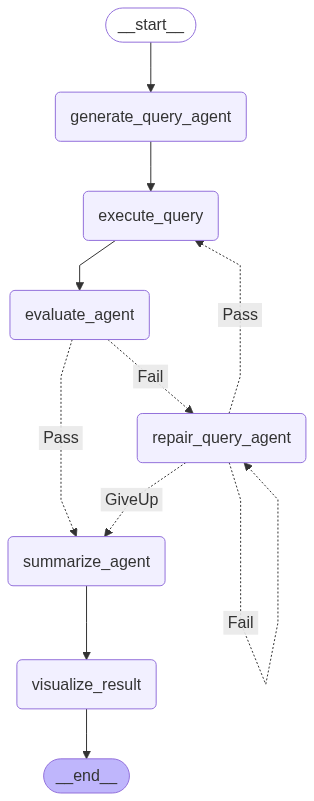
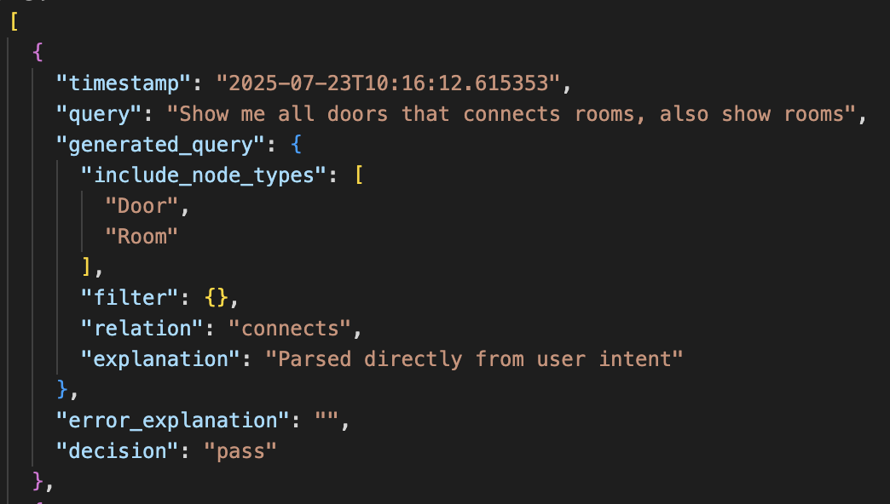

## Multi Agent Workflow: 
. 
- ### generate_query_agent (LLM API CALL)
Understands the user prompt and converts it into a structured graph query.

- ### execute_query
Applies the generated query on the BIM graph and returns matched nodes and edges.

- ### evaluate_agent (LLM API CALL)
Checks if the query result is valid and sufficient to answer the user’s request.

- ### repair_query_agent (LLM API CALL)
Improves the query using feedback from evaluation if the previous result was not good enough.

- ### summarize_agent (LLM API CALL)
Produces a short explanation of the result, mentioning nodes and relations found.

- ### visualize_result
Generates a 2D image showing the nodes and edges returned by the query.

## Future Enhancements: 

**Functionalities:** 
- **Logging:** 
 Evaluate agents saves record after each execution: 

 it will help us to avoid from errors if we get the same(or similar) prompt.
 When we get many many questions we can create **vector embeddings** for previously asked questions and we can do **few-shot prompting**, by this way we might by-pass **evaluate** agent and minimize **latency**. 

- we can call **summarize** and **visualize** agents in *parellel* so that it reduces the latency a bit. 

- math tools that are in utils.py  can be added as toolset into the agentic workflow, hence it can use those tools when needed. 

## Notes: 
- I used an advanced llm for the **evaluate agent** since that is most crucial step

 
 
 